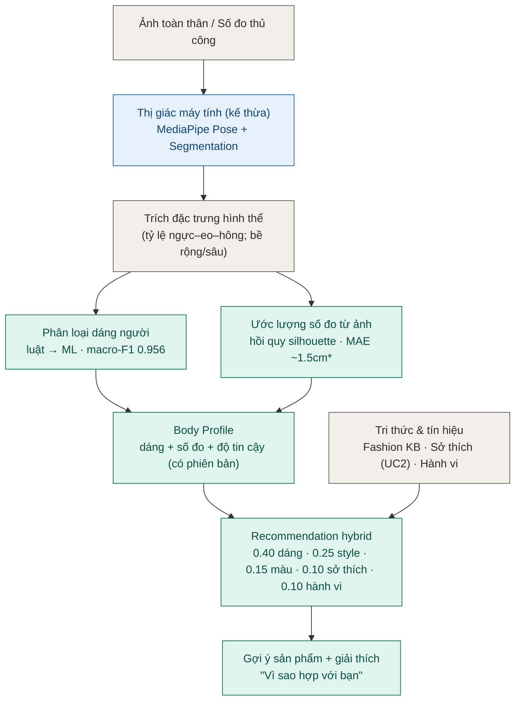

# Sơ đồ pipeline AI — DressSense

Luồng xử lý từ ảnh/số đo đến gợi ý có giải thích. Màu: **xanh dương = kế thừa**
(MediaPipe), **xanh lá = tự phát triển**, **xám = dữ liệu/nguồn**.

\* MAE ~1.5cm đo trên **ảnh synthetic (CALVIS)** — điều kiện sạch (cận trên lạc quan); trên
ảnh người thật cần bổ sung dữ liệu + đo domain gap.

## Chú giải các bước
1. **Đầu vào**: ảnh toàn thân hoặc số đo thủ công (UC3.1).
2. **Thị giác (kế thừa)**: MediaPipe Pose Landmarker (33 điểm mốc) + segmentation mask.
3. **Trích đặc trưng**: tỷ lệ ngực–eo–hông (phân loại dáng); bề rộng/sâu hoặc silhouette (số đo).
4. **Phân loại dáng** (luật + ML) và **ước lượng số đo** (hình học/hồi quy) — tự phát triển.
5. **Body Profile**: tổng hợp dáng + số đo + độ tin cậy, lưu kèm phiên bản; đồng bộ hồ sơ (UC2.3).
6. **Recommendation hybrid**: kết hợp điểm hợp dáng (Fashion KB), sở thích (UC2), hành vi →
   xếp hạng + sinh câu **"Vì sao hợp với bạn"** (UC5).
